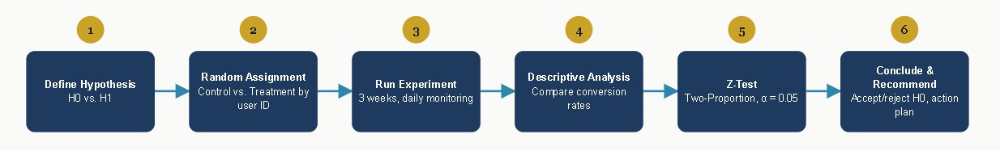

## Role
Data Analyst

## Problem
An online course platform experienced a low conversion rate after the free trial period ended, with a target increase of 5%. The initial hypothesis: requiring credit card information at the start of free-trial registration was a barrier causing prospective users to abandon sign-up. However, there was no empirical data to prove or disprove this — product decisions had been based on assumptions rather than statistical testing.

## Solution
Designed and executed an A/B test splitting 294,000+ users randomly into two groups: a control group with the original registration flow (credit card required) and a treatment group with the new flow (no credit card required). The experiment ran for three weeks and was evaluated using a Two-Proportion Z-Test to assess the statistical significance of conversion rate differences between groups. Daily experiment progress was monitored through a Looker Studio dashboard to detect anomalies early.

## Dataset Used
- User ID, group assignment (control/treatment), and conversion status (converted yes/no)
- Planned sample size of 300,000 users, with a realized total of **294,478 users** (147,202 in control, 147,276 in treatment)
- The experiment ran for 3 weeks, with daily progress data monitored via dashboard

## Tools
- **Looker Studio (Google Data Studio)** — daily monitoring dashboard for control vs. treatment conversion rate
- **Two-Proportion Z-Test** — statistical method to test significance of the difference in conversion proportions

## Analysis Process

- Random assignment of users to control (old flow, credit card required) and treatment (new flow, no credit card) groups based on **user ID**, not demographic segmentation, to avoid selection bias
- Statistical hypotheses formulated: H0 = the registration flow change has no impact on conversion rate; H1 = it does have an impact
- Daily monitoring via dashboard to detect anomalies as early as possible over the 3-week experiment
- Descriptive analysis of conversion results for both groups
- Two-Proportion Z-Test (α = 0.05) run to test statistical significance of the conversion rate difference

## Key Insights
- Control group conversion rate: 12.04% (17,723 of 147,202 users)
- Treatment group conversion rate: 11.89% (17,514 of 147,276 users)
- Z-test result: calculated Z = 1.236, below the critical value Z = 1.9599 (p-value = 0.1196 > α 0.05) → **H0 accepted**, no significant difference between the two groups
- Removing the credit card requirement was statistically proven **not** to increase conversion rate
- This finding prevented the rollout of an ultimately ineffective change and redirected the team toward investigating other root causes

## Recommendations
Four action items resulted from further post-experiment investigation:
- Add more payment methods (bank transfer/ATM, e-wallets, convenience stores, etc.), not just credit cards
- Create post-free-trial promotions (discounts, class bundles)
- Adjust pricing (regional pricing, alternative duration options)
- Add social proof (reviews, testimonials) to the registration page

The A/B testing framework built (random assignment by user ID + monitoring dashboard + Z-test) can be reused to test future product hypotheses.

## Persentation Link

Access [Persentation Project](https://docs.google.com/presentation/d/1SoMmlWBVxFguA6JfbeLk-xTUaSsSrL5F/edit?slide=id.p5#slide=id.p5)
