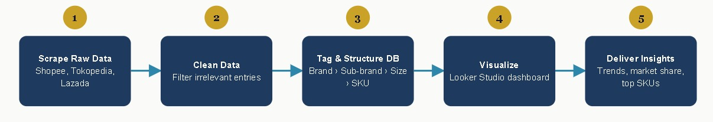
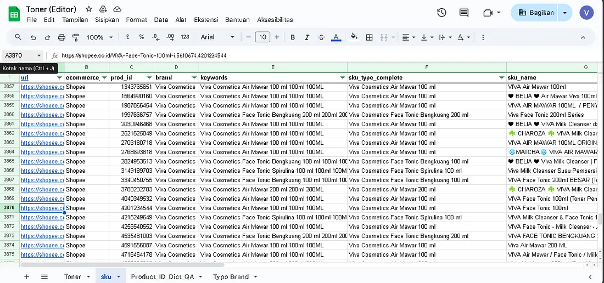
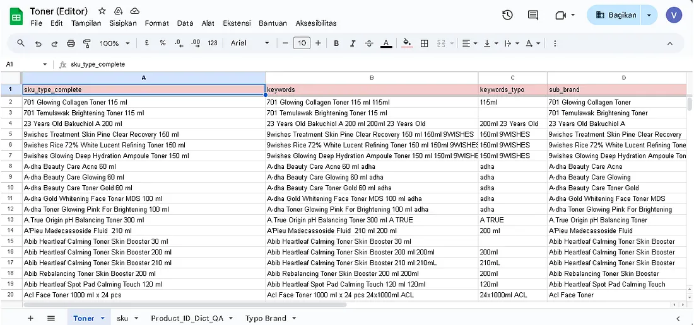
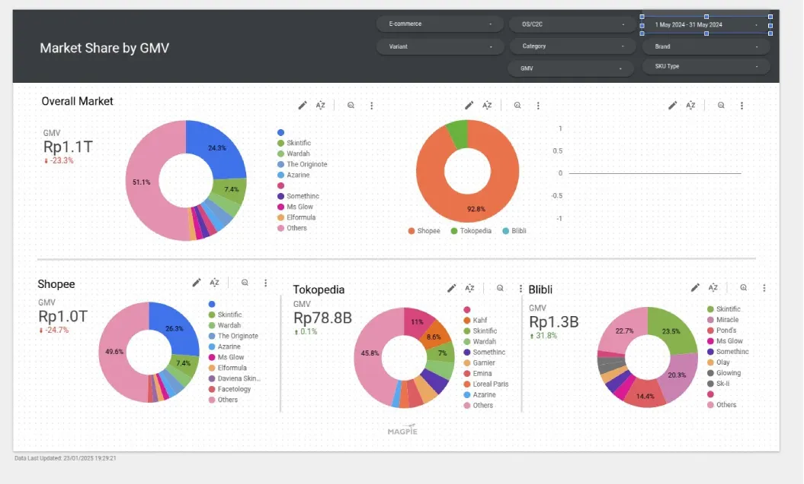

## Role
 
Data Analyst
 
## Problem
 
The client needed an in-depth understanding of toner skincare product sales performance across three major marketplaces: Shopee, Tokopedia, and Lazada. The available data came from web scraping in raw form — many irrelevant entries, inconsistent product naming across platforms, and no database structure that allowed cross brand analysis. Without clean, structured data, basic questions couldn't be answered: which brand is dominant, which SKU sells best, and which platform contributes most to total sales.
 
## Solution
 
Built a three-stage pipeline — data cleaning, data collection, and data analysis — that turned raw scraped listings into a structured toner sales database visualized in Looker Studio. New products were tagged through a custom system before entering the database, which was organized into a four-level hierarchy (brand → sub-brand → size → SKU) to support drill-down analysis across 10+ client brands.
 
## Dataset Used
 
- Raw data from web scraping across 3 marketplaces — Shopee, Tokopedia, Lazada — specifically for the toner product category
- After cleaning, data was structured into a brand → sub-brand → size → SKU hierarchy, covering 10+ client brands.

## Tools
 
- **Web scraping** — source of raw data collection
- **Custom tagging system** — for standardizing new product names before entering the database
- **Excel/Spreadsheet** — for building the tiered database structure
- **Looker Studio** — visualization of sales trends and market share

## Analysis Process

- **Data Cleaning** — filtering out entries not relevant to "toner," keeping only genuinely relevant data

- **Data Collection** — new products found during scraping were tagged via a custom system to prevent duplication caused by inconsistent naming across platforms, then organized into a 4-level database structure (brand, sub-brand, size, SKU)

- **Data Analysis & Visualization** — structured data was visualized in Looker Studio to show sales trends, cross-platform market share, and best-selling SKUs per brand

## Key Decisions
 
- **Custom tagging for new products** — Products found during scraping that aren't yet in the database are tagged through a dedicated system before being added. This prevents duplicates and keeps naming consistent across platforms that often use different names for the same SKU.
- **Four-level database structure** — Data is organized as brand → sub-brand → size → SKU rather than a flat list, enabling drill-down from brand level to specific product level in a single query.
- **Cross-platform market share analysis** — The dashboard shows not just absolute sales but market share distribution per platform per brand, giving the client visibility into where their products are comparatively strong or weak.

## Key Insights
 
- The structured toner database successfully covers all product variants from Shopee, Tokopedia, and Lazada
- The dashboard displays sales trends, cross-platform market share, and top SKUs per brand simultaneously
- The analysis supports performance evaluation for 10+ client brands, including Somethinc, and shows where the client's products are comparatively strong or weak across platforms

## Recommendations
 
- Use the per-platform market share report as the basis for monthly marketing budget allocation, focusing on the platform with the highest growth.
- Add routine monitoring (weekly/monthly) to detect new competitor SKUs appearing in scraped data, keeping the database and insights current.

