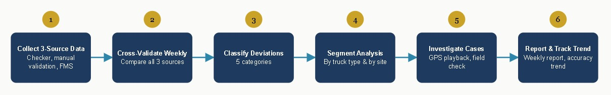

## Role
Data Analyst

## Problem
A newly implemented Fleet Management System (FMS) at a mine site was designed to automatically calculate dump truck hauling trips. However, its accuracy had not been systematically validated against manual data from field checkers. Without structured validation, there was no way to know how reliable the FMS automation output was, where its biggest gaps were, or whether it was fit to serve as a basis for operational decision-making.

## Solution
Built a weekly data validation pipeline performing cross-validation across three simultaneous data sources: manual field checker reports, internal manual validation, and FMS automation output. Every discrepancy between sources was identified, classified by root cause type, and investigated through GPS playback and field verification. Validation results were compiled into structured weekly reports presented to the management team throughout a four-week trial period.

## Dataset Used
- Daily hauling trip data from 3 sources: manual field checker records, internal manual validation, and automated FMS output
- Trial data collected across 2 sites (referred to here as Site A and Site B) over a 4-week trial period
- Breakdown included: daily & weekly accuracy, accuracy per site, accuracy per truck category, product vs. non-product trip volume, GPS and trigger logs, and unit maintenance status
- Deviation case studies documented for each category - e.g., a suspected human-error case, a "ghost trip" case, a total GPS-signal-loss case, a unit signal-flicker case, and a trigger-log-error case

## Tools
- **Fleet telematics platform** — for GPS playback, trigger logs, and unit monitoring
- **On-unit FMS hardware** — dashcams, current/voltage sensors, GPS
- **Excel/Spreadsheet** — compiling manual trip records and standardized reporting templates
- **Looker Studio** — weekly dashboard for accuracy and deviation trend monitoring

## Analysis Process

- Built a weekly validation pipeline that cross-validates data across the manual checker records, internal manual validation, and automated FMS output

- Classified deviations into 5 categories: Total GPS Off, Spatial/Partial Off, Ghost Trip, Unit Flicker, and Trigger Log Error

- Analyzed truck categories and sites separately, since deviation patterns and trip volumes differed significantly between segments

- Monitored accuracy at two levels in parallel — daily (fast anomaly detection) and weekly (improvement trend)

- Investigated each deviation via GPS playback and field verification, documenting representative case studies per deviation type

- Compiled results into a weekly report presented to the operations team

## Key Insights
- The structured toner database successfully covers all product variants from Shopee, Tokopedia, and Lazada
- The dashboard displays sales trends, cross-platform market share, and top SKUs per brand simultaneously
- The analysis supports performance evaluation for 10+ client brands, and shows where the client's products are comparatively strong or weak across platforms

## Recommendations
- Standardize geofencing boundaries at the lower-accuracy site (Site A), following the practices that helped Site B reach 99% accuracy

- Follow up promptly on the remaining flagged unit still awaiting maintenance, and schedule routine preventive maintenance for all flagged units

- Develop a specific procedure for the newly emerging "ghost trip" deviation category so it doesn't recur in future periods

- Formalize this weekly validation framework as a standard ongoing process, while continuing to push accuracy toward the 95% target