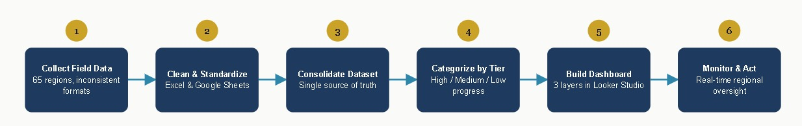

## Role
Data Analyst

## Problem
The program covers physical construction across 65 regions nationwide. The planning team had no way to monitor each region's progress in real time data arrived from 65 different sources in inconsistent formats, with no centralized visibility to identify which regions were falling behind. Without centralized monitoring, intervention decisions were made late and relied on manual reports that weren't always accurate.

## Solution
Built an interactive Looker Studio dashboard aggregating data from all 65 regions into a single centralized view. The dashboard presents three layers of information: construction progress status per region, regional profile data, and budget realization. Data was first cleaned and standardized through Excel and Google Sheets before being connected to Looker Studio to ensure cross-region consistency.

## Dataset Used
- Physical construction progress data from 65 regions nationwide (% completion per region)
- General profile data for each community
- Budget realization data per region
- All data originated from field reports submitted per region, initially in inconsistent formats

## Tools
- **Excel & Google Sheets** — data cleaning and standardization before loading into the dashboard
- **Looker Studio** — centralized dashboard visualization platform

## Analysis Process
- Data from all 65 regions was collected, then cleaned and standardized upstream in Excel/Google Sheets (kept out of the dashboard itself, to keep it lightweight and fast)

- All data was routed into a single centralized dataset — one source of truth instead of one file per region

- Regions were grouped into 3 progress tiers (High / Medium / Low) based on completion percentage, not absolute figures

- The dashboard was structured into 3 separate information layers - physical progress, region profile, and budget - so field teams and budget teams could access relevant information without noise

## Key Insights
- The planning team can identify lagging regions within seconds, without reading manual reports one by one
- Standardization successfully unified data from 65 previously inconsistent sources
- Budget realization per region is now transparent and accessible at any time to relevant stakeholders

## Recommendations
- Build a more standardized data-input process at the regional level from the start (e.g., a uniform template), reducing cleaning effort in Excel/Sheets.

- Add automatic alerts when a region drops a tier (e.g., from Medium to Low) for more proactive intervention, rather than only reactive checks when the dashboard is opened.

- Periodically review the three-tier thresholds so they stay relevant as the number of regions or project complexity grows.

## Dashboard Link
Access [Dashboard KNMP](https://datastudio.google.com/u/0/reporting/3bfcb82d-8229-4fbe-b255-9a52f96d9e8b/page/p_wtqud3yktd)
